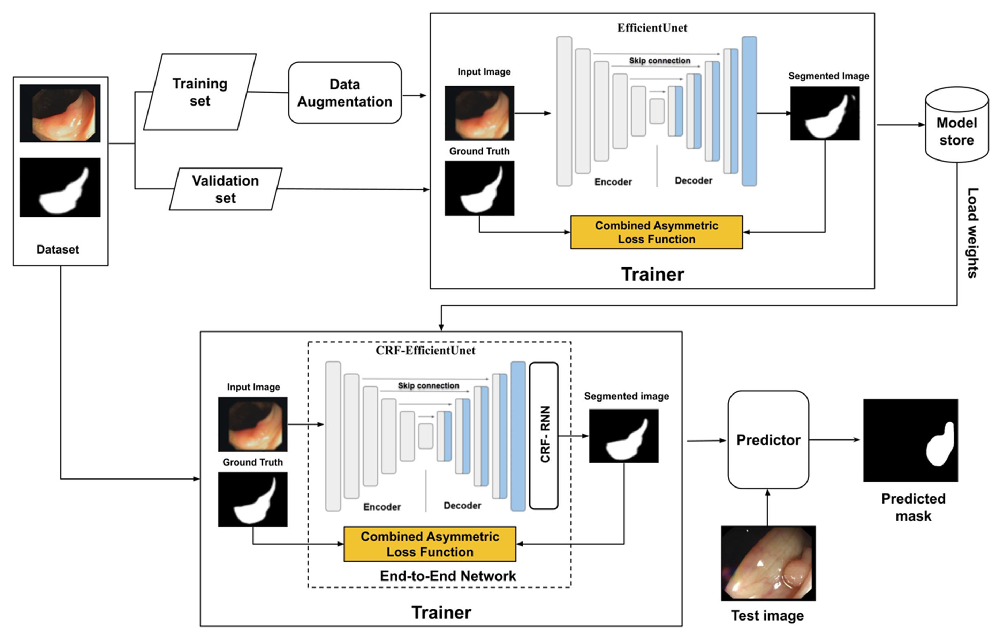

# CRF-EfficientUNet
This repository is an official Keras implementation of the paper "CRF-EfficientUNet: an improved UNet framework for polyp segmentation in colonoscopy images with combined asymmetric loss function and CRF-RNN layer" [paper](https://ieeexplore.ieee.org/abstract/document/9622208) from IEEE Acess 2021. 
# Prerequisites
1. Linux or OSX
2. NVIDIA GPU + CUDA CuDNN (CPU mode and CUDA without CuDNN may work with minimal modification, but untested)

4. tensorflow==1.13.1
5. numpy==1.18.5
6. Keras==2.2.4
7. opencv-python==4.3.0
